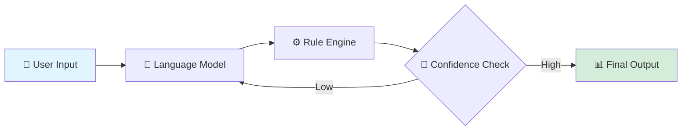

# 🛡️ ClaimSense — Insurance Claims Triage System

<div align="center">


**An intelligent system that analyzes insurance claims using advanced reasoning and rule-based logic to classify risk, detect fraud signals, and recommend actions.**

[Features](#-features) • [Installation](#-installation) • [Usage](#-usage) • [Documentation](#-how-it-works)

---

</div>

## 📋 Overview

ClaimSense simulates how modern insurance systems triage claims through a hybrid approach:

| Component | Function |
|-----------|----------|
| 🧠 **NLP Engine** | Understands claim context through natural language processing |
| ⚖️ **Risk Calculator** | Calculates risk using deterministic rules |
| 🔄 **Iterative Analysis** | Re-evaluates low-confidence decisions automatically |
| 📊 **Explainable Output** | Generates transparent, interpretable results |
| 💻 **Interactive UI** | Provides real-time interface via Streamlit |

---

## ✨ Features

### 🎯 Intelligent Analysis Engine

Powered by Google Gemini API to:
- ✅ Classify claim type automatically
- 🚩 Detect fraud signals and anomalies
- 🔍 Extract key risk factors from unstructured text

### ⚙️ Rule-Based Risk Engine

- 🔗 Combines structured logic with language model output
- 🎚️ Ensures reliability and control over decisions
- 📈 Generates final risk score (0–100 scale)

### 🔄 Iterative Re-Evaluation

- 🤖 Automatically reprocesses claims with low confidence scores
- 📈 Improves decision quality without manual intervention
- 🎯 Refines analysis through multiple reasoning passes

### 📖 Explainable Decision-Making

Clear separation of outputs:
- **🔑 Key Risk Factors** — Raw signals identified from claim
- **💡 Fraud Explanation** — Human-readable reasoning behind decisions

> Makes outputs interpretable and actionable for claims adjusters and compliance teams.

### 🛡️ Fault-Tolerant Design

- ⚠️ Handles API failures (quota limits, downtime)
- 🔄 Uses fallback responses to ensure system continuity
- 📝 Logs errors for debugging and monitoring

### 💻 Interactive Dashboard

Built with **Streamlit**:
- 📝 Input claim details through intuitive forms
- 📊 View risk metrics and confidence scores
- 🧠 Understand reasoning visually with charts
- 📋 Export results for documentation

---

## 🏗️ Project Structure

```
ClaimSense/
│
├── 📱 app.py              # Streamlit UI
├── 🖥️  main.py             # CLI runner
│
├── 🤖 agent.py            # Core agent logic
├── 🧠 llm_engine.py       # Gemini API + fallback
├── ⚙️  rules.py            # Risk scoring logic
├── 📝 prompts.py          # Prompt templates
│
├── 🔐 .env                # API key (create this)
├── 📦 requirements.txt
└── 📖 README.md
```

---

## 🚀 Installation

### Prerequisites

- Python 3.8 or higher
- pip package manager
- Google Gemini API key ([Get one here](https://ai.google.dev/))

### Step 1: Clone the Repository

```bash
git clone https://github.com/yourusername/claimsense.git
cd claimsense
```

### Step 2: Install Dependencies

```bash
pip install -r requirements.txt
```

### Step 3: Setup API Key

Create a `.env` file in the project root:

```env
GEMINI_API_KEY=your_api_key_here
```

> ⚠️ **Important:** Never commit your `.env` file to version control!

---

## 💻 Usage

### 🌐 Streamlit Interface (Recommended)

Launch the interactive web dashboard:

```bash
streamlit run app.py
```

Then open your browser to `http://localhost:8501`


*Replace with actual screenshot of your Streamlit app*

---

**Sample Test Cases:**
- ✅ High-value claims with minor damage
- ✅ Frequent small claims (pattern detection)
- ✅ Emotional bias scenarios
- ✅ Missing or incomplete data handling

---

### ⚡ CLI Demo

Quick command-line demonstration:

```bash
python main.py
```

---

## 🔍 How It Works

<div align="center">



</div>

### Step-by-Step Process

#### 1️⃣ **Input Collection**
User provides:
- 📄 Claim description (free text)
- 💰 Claim amount
- 👤 User claim history

#### 2️⃣ **Language Model Reasoning**
Gemini analyzes and extracts:
- 🏷️ Claim type classification
- ⚠️ Risk level assessment
- 🚨 Fraud suspicion indicators
- 🔍 Key risk factors

#### 3️⃣ **Rule Engine Processing**
Custom business logic calculates:
- 📊 Risk score (0–100)
- 🎯 Confidence score
- ⚡ Recommended action

#### 4️⃣ **Iterative Refinement**
If confidence score < 70:
- 🔄 System re-analyzes claim
- 🎯 Improves output quality
- ✅ Final decision made

#### 5️⃣ **Final Output**

```json
{
  "risk_score": 78,
  "confidence_score": 72,
  "fraud_suspicion": "Yes",
  "recommended_action": "Manual Review",
  "key_risk_factors": [
    "Claim amount significantly higher than damage estimate",
    "Multiple claims filed within 30 days"
  ],
  "fraud_explanation": "The claim exhibits patterns consistent with potential fraud..."
}
```

---

## ⚠️ Limitations

| Limitation | Impact |
|-----------|--------|
| 🌐 **External API Dependency** | Rate limits may apply during peak usage |
| 🎲 **Output Variability** | Model outputs may vary slightly between runs |
| 🔧 **Simplified Rules** | Rule engine can be extended for production use |
| 📊 **No Historical DB** | Currently processes claims independently |

---

## 🚀 Future Roadmap

- [ ] 📊 **Claim History Database** — PostgreSQL integration for historical analysis
- [ ] 🤖 **Multi-Agent System** — Specialized agents for different claim types
- [ ] 📈 **Analytics Dashboard** — Trend analysis and reporting features
- [ ] 📁 **File Upload** — Process PDF claim documents and images
- [ ] 🌐 **REST API** — Backend API for third-party integrations
- [ ] 🔐 **User Authentication** — Role-based access control
- [ ] 📱 **Mobile App** — React Native mobile interface

---

## 📚 Key Technical Highlights

<table>
<tr>
<td width="50%">

### 🏗️ Architecture
- Hybrid system (Language Model + Rules)
- Iterative reasoning loops
- Modular, extensible design

</td>
<td width="50%">

### 🔧 Engineering
- Robust error handling
- API rate limit management
- Explainable decision-making

</td>
</tr>
</table>

---

## 👨‍💻 Author

**Ritesh**  
🎓 Aspiring AI/ML Engineer | 📊 Data Science Enthusiast

[](https://linkedin.com/in/yourprofile)
[](https://github.com/yourusername)
[](mailto:your.email@example.com)

---

## 🤝 Contributing

Contributions are welcome! Please feel free to submit a Pull Request.

1. Fork the repository
2. Create your feature branch (`git checkout -b feature/AmazingFeature`)
3. Commit your changes (`git commit -m 'Add some AmazingFeature'`)
4. Push to the branch (`git push origin feature/AmazingFeature`)
5. Open a Pull Request

---

## 📄 License

This project is licensed under the MIT License - see the [LICENSE](LICENSE) file for details.

---

## ⭐ Show Your Support

If you found this project useful or interesting:
- ⭐ **Star this repository**
- 🔀 **Fork it** to build your own version
- 💬 **Share feedback** or suggestions
- 🤝 **Connect on LinkedIn**

---

<div align="center">

**Made with ❤️ by Ritesh**


</div>
